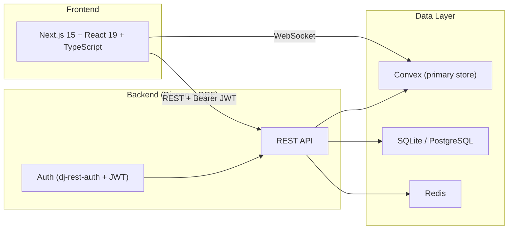

# PunPost

A **production-ready modular monolith** blogging platform: Django REST Framework + Next.js + Convex.

## Overview



- **Auth**: JWT (API) + Sessions (Admin) + OAuth 2.0 (Google/GitHub)
- **Real-time**: Convex as primary data store with live subscriptions
- **Layered monolith**: Presentation → Service → Repository
- **Production patterns**: RBAC, rate limiting, idempotency, token blacklist

## Quick Start

```bash
# Backend (Django)
cd backend && pip install -r requirements.txt && python manage.py migrate && python manage.py runserver

# Frontend (Next.js)
cd frontend && npm install && npm run dev

# Convex (Real-time DB)
cd convex && npm install && npx convex dev
```

## Documentation

All docs use **Mermaid** diagrams for architecture and data flow.

| Doc | Description |
|-----|-------------|
| [Architecture](docs/architecture.md) | System design, layers, data flows, tech stack |
| [Technical Reference](docs/technical.md) | Settings, endpoints, auth, rate limiting, idempotency, testing |
| [Educational Guide](docs/educational.md) | Concept explanations for learners |

## API Overview

| Domain | Base Path | Key Endpoints |
|--------|-----------|---------------|
| Auth | `/api/auth/` | login, logout, registration, token/refresh |
| Users | `/api/users/` | me, detail |
| Posts | `/api/posts/` | list, create, retrieve, comments |
| Billing | `/api/billing/` | charge, subscribe, subscription, cancel |
| Core | `/api/` | health |

## License

See [LICENSE](LICENSE).
