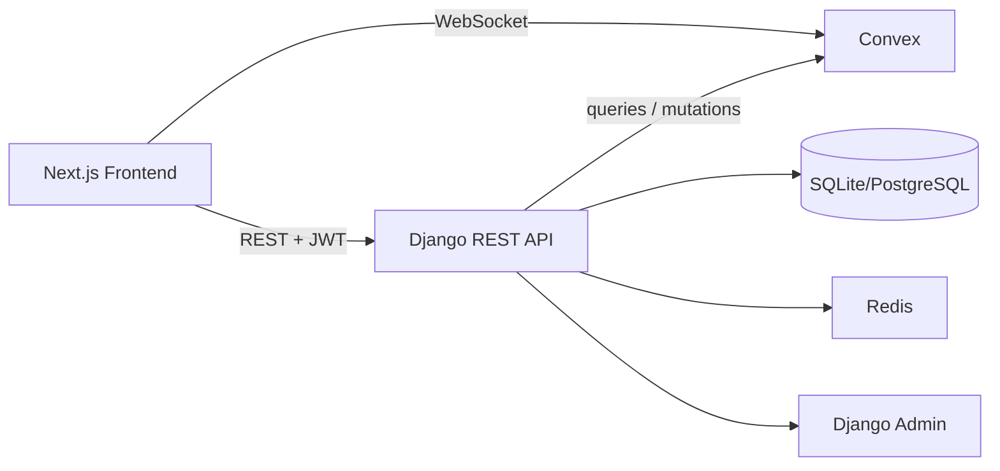
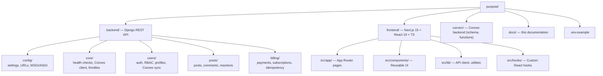

# PunPost Documentation

Welcome to the PunPost documentation. This project is a **production-ready monolithic blogging platform** demonstrating modern backend engineering practices.

## Documentation Index

| Document | Description | Audience |
|----------|-------------|----------|
| [Architecture](architecture.md) | High-level system design, layer responsibilities, **Mermaid data flows**, tech stack | Architects, Senior Engineers |
| [Technical Reference](technical.md) | Settings deep-dive, API endpoints, auth flows, rate limiting, idempotency, testing | Backend Engineers |
| [Frontend Guide](frontend.md) | Landing page, NotchNavbar, PageShell, OAuth callback UX, dashboard & app routes | Frontend Engineers |
| [Deploy Guide](deploy.md) | Cloudflare Workers, Render Blueprint, Convex prod, OAuth URIs | DevOps / Full-stack |
| [Educational Guide](educational.md) | Concept explanations with code examples: REST, AuthN/AuthZ, JWT, OAuth, Rate Limiting, Idempotency, Monolith vs Microservices, Convex, Redis, Testing | Learners, Junior-Mid Engineers |

> All structural and data-flow diagrams in this documentation use **Mermaid** and render natively on GitHub/GitLab.

---

## System Overview



---

## Quick Start

### Backend (Django)
```bash
cd backend
python -m venv venv && source venv/bin/activate
pip install -r requirements.txt
cp ../.env.example ../.env  # Configure values
python manage.py migrate
python manage.py runserver
```

### Frontend (Next.js)
```bash
cd frontend
npm install
npm run dev
```

### Convex (Real-time DB)
```bash
cd convex
npm install
npx convex dev
```

---

## Key Concepts Covered

| Concept | Implementation |
|---------|----------------|
| **RESTful API** | DRF ViewSets, proper status codes, nested resources |
| **Authentication** | JWT (API) + Session (Admin) + OAuth 2.0 (Google/GitHub) |
| **Authorization** | Role-based (Reader/Author/Admin) + Object-level permissions |
| **Rate Limiting** | DRF throttling with Redis-backed distributed limits |
| **Idempotency** | Redis-cached responses keyed by `Idempotency-Key` header |
| **Real-time Data** | Convex as primary store with live subscriptions |
| **Layered Architecture** | Presentation → Service → Domain → Infrastructure |
| **Testing** | Pytest + factory-boy, unit + integration + E2E structure |

---

## Project Structure



---

## Environment Variables

See [`.env.example`](../.env.example) for all required variables:

- **Django**: `SECRET_KEY`, `DEBUG`, `ALLOWED_HOSTS`
- **Convex**: `CONVEX_URL`, `CONVEX_DEPLOY_KEY`
- **Redis**: `REDIS_URL`
- **JWT**: `JWT_ACCESS_TOKEN_LIFETIME_MINUTES`, `JWT_REFRESH_TOKEN_LIFETIME_DAYS`
- **OAuth**: `GOOGLE_CLIENT_ID/SECRET`, `GITHUB_CLIENT_ID/SECRET`
- **Frontend**: `FRONTEND_URL` (CORS)

---

## API Endpoints Summary

| Domain | Base Path | Key Endpoints |
|--------|-----------|---------------|
| Auth | `/api/auth/` | login, logout, register, token/refresh, social |
| Users | `/api/users/` | me, detail |
| Posts | `/api/posts/` | list, create, retrieve, update, delete, comments |
| Billing | `/api/billing/` | charge, subscribe, subscription, cancel |
| Core | `/api/` | health |

---

## Learning Path

1. **Start here**: [Educational Guide](educational.md) — Concept explanations with code
2. **Reference**: [Technical Reference](technical.md) — Settings, APIs, implementation details
3. **Architecture**: [Architecture](architecture.md) — System design, data flows, decisions

---

## Contributing

See the main [README.md](../README.md) for contribution guidelines.