# PunPost Architecture Documentation

## Overview

PunPost is a **monolithic, layered (N-tier) blogging platform** built with Django REST Framework and Next.js. It demonstrates production-ready patterns for authentication, authorization, rate limiting, idempotency, and real-time data synchronization using Convex as the primary data store.

> All diagrams below are [Mermaid](https://mermaid.js.org/) and render natively on GitHub/GitLab.

---

## High-Level Architecture

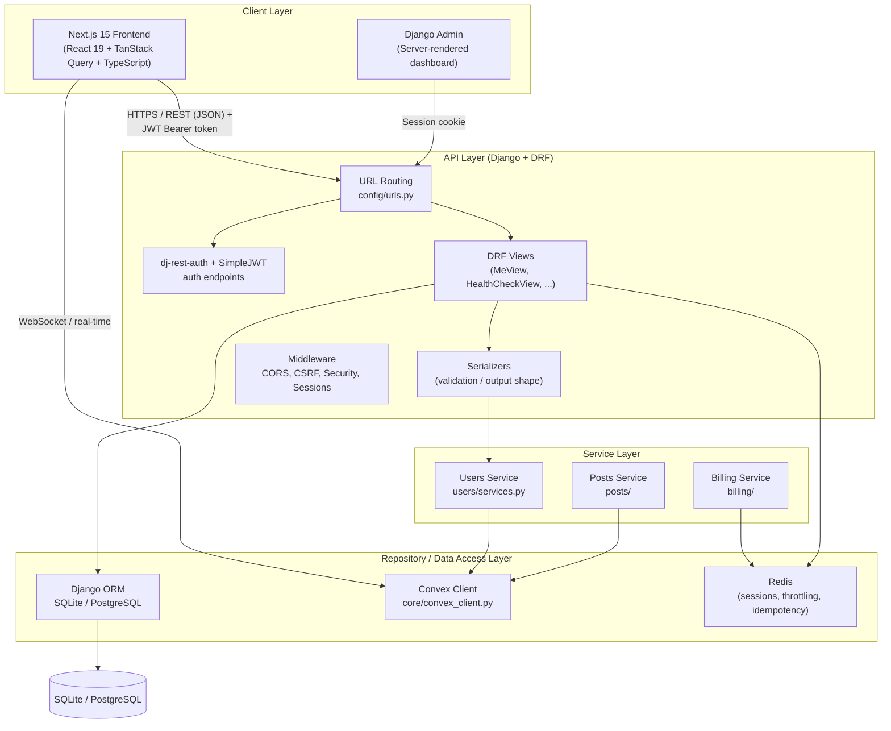

---

## Layered Architecture (Django Monolith)

PunPost follows a strict **Presentation → Service → Repository** layering. Each Django app owns its own `urls.py`, `views.py`, `serializers.py`, and `services.py`, which keeps module boundaries clean and enables future service extraction.

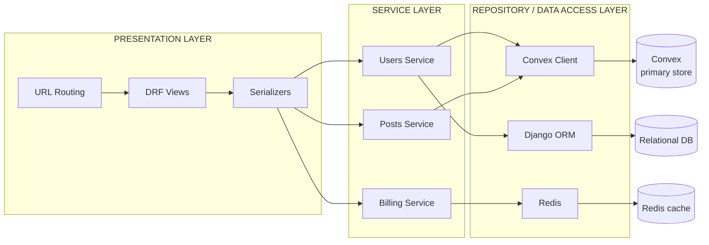

---

## Layer Responsibilities

### 1. Presentation Layer (`config/`, `core/views.py`, `users/views.py`)
- **URL Routing**: Maps HTTP endpoints to views (`config/urls.py`)
- **DRF Views**: Handle HTTP request/response, authentication, permissions
- **Serializers**: Validate input, serialize output, handle nested relationships

### 2. Service Layer (`users/services.py`, future `posts/services.py`, `billing/services.py`)
- **Business Logic**: Encapsulates domain rules, workflows, cross-cutting concerns
- **Convex Sync**: Synchronizes Django auth users with Convex documents (`sync_user_to_convex`)
- **Idempotency**: Handles payment/billing deduplication

### 3. Repository / Data Access Layer
- **Django ORM**: Sessions, admin, authentication, migrations
- **Convex Client**: Primary data store for posts, users, comments (real-time)
- **Redis**: Session storage, rate limiting counters, idempotency keys

---

## Data Flows

### 1. User Registration

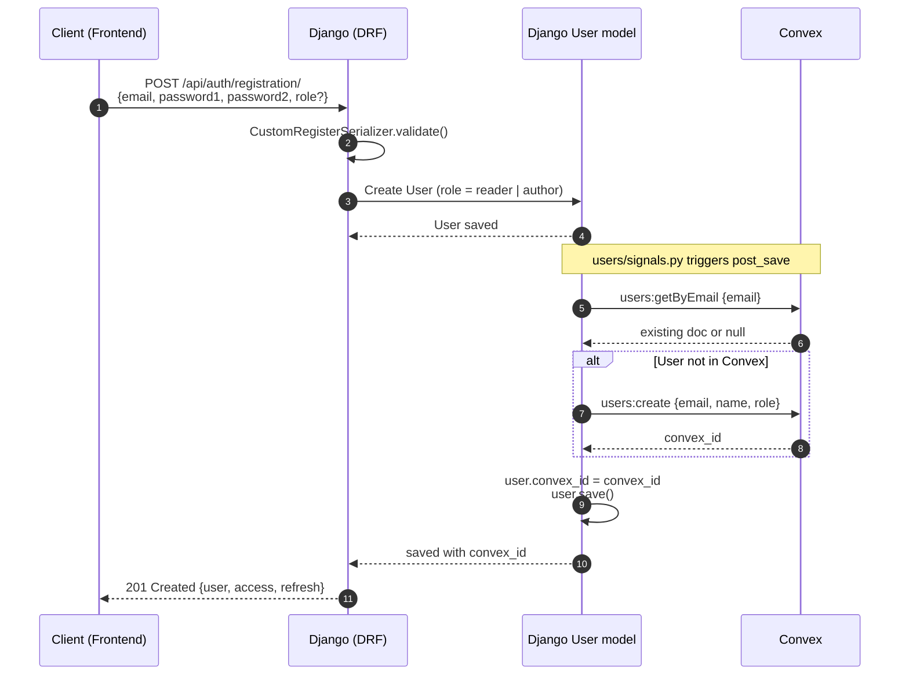

### 2. Login & JWT Issuance

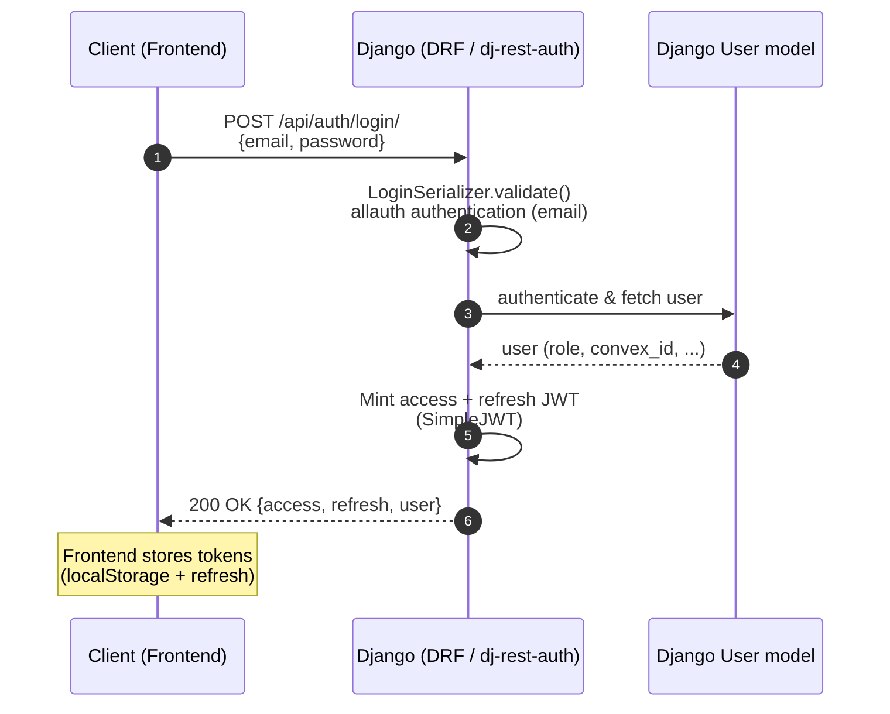

### 3. Authenticated Request (`GET /api/users/me/`)

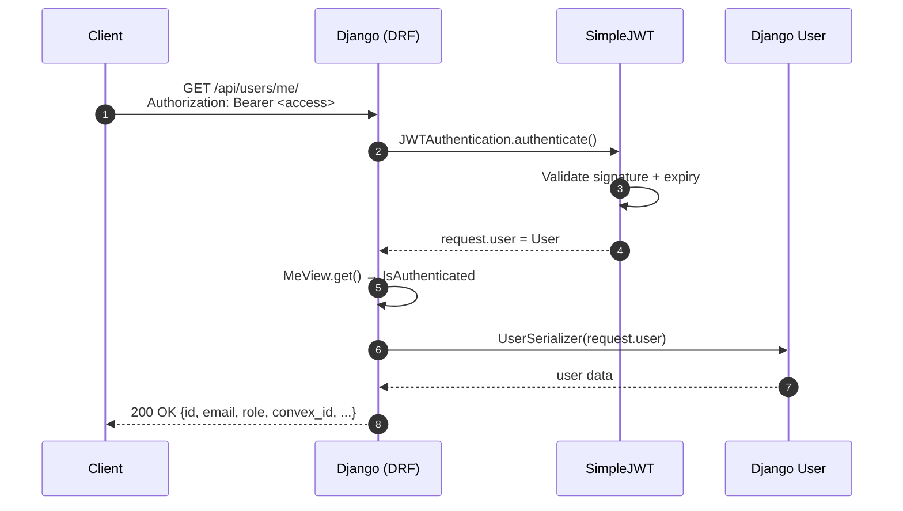

### 4. Token Refresh & Logout

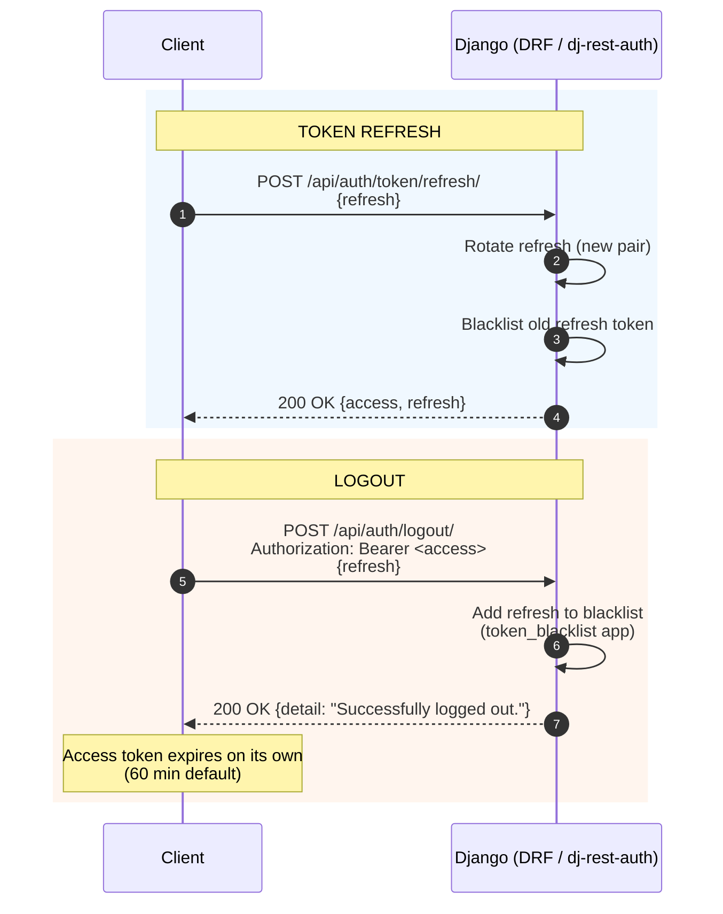

### 5. Post Creation (Convex-backed, future API)

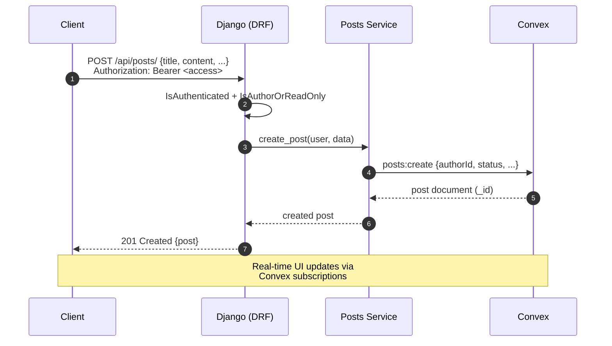

### 6. Health Check

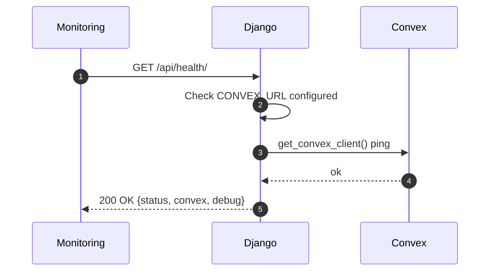

---

## Technology Stack

| Layer | Technology | Purpose |
|-------|------------|---------|
| **Backend Framework** | Django 5.x + DRF 3.15 | REST API, admin, auth |
| **Auth** | JWT (djangorestframework-simplejwt) + Session (Redis) | API + Dashboard auth |
| **OAuth** | django-allauth (Google, GitHub) | Social login |
| **Primary DB** | Convex | Real-time posts, users, comments |
| **Relational DB** | SQLite (dev) / PostgreSQL (prod) | Sessions, Django admin, auth |
| **Cache/Queue** | Redis + django-redis | Sessions, rate limiting, idempotency |
| **Frontend** | Next.js 15 + React 19 + TypeScript | SSR/SSG, client-side app |
| **State Mgmt** | TanStack Query (React Query) | Server state, caching |
| **Styling** | Tailwind CSS | Utility-first CSS |
| **Animation** | Framer Motion | Page transitions, micro-interactions |

---

## Monolith vs Microservices

This is a **modular monolith** — not microservices. Benefits:

| Aspect | Monolith Approach |
|--------|-------------------|
| **Deployment** | Single container/process |
| **Transactions** | ACID across Django models |
| **Debugging** | Single trace, shared logs |
| **Refactoring** | Easy module extraction later |
| **Team Size** | Ideal for 1-10 developers |

### Module Boundaries (for future extraction)

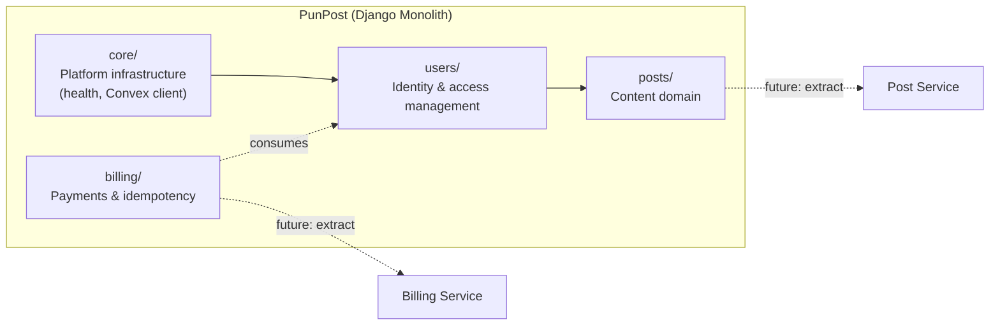

Each app has its own `models.py`, `views.py`, `urls.py`, `services.py`, `serializers.py` — ready for future service extraction.

---

## Security Architecture

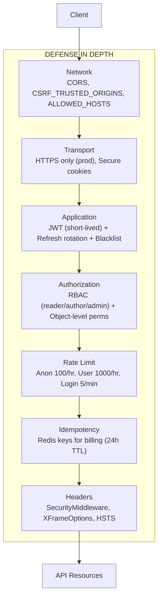

---

## Scalability Considerations

| Component | Current | Scale Strategy |
|-----------|---------|----------------|
| **Django** | Single process | Gunicorn workers + load balancer |
| **Convex** | Managed | Auto-scales horizontally |
| **Redis** | Single instance | Redis Cluster / Sentinel |
| **Database** | SQLite | PostgreSQL + read replicas |
| **Static Files** | WhiteNoise | CDN (Cloudflare, AWS CloudFront) |
| **Frontend** | Next.js dev | Vercel / Netlify / Docker + Nginx |

---

## Directory Structure

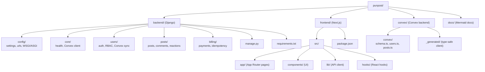

---

## Key Design Decisions

1. **Convex as Primary Data Store**: Real-time subscriptions, offline-first, automatic scaling
2. **Django for Auth/Admin**: Battle-tested auth, admin interface, session management
3. **JWT for API, Sessions for Admin**: Different token strategies per client type
4. **Role-Based Access Control**: Three roles (reader, author, admin) with extensible permissions
5. **Idempotency Keys**: Prevents duplicate charges on billing endpoints
6. **Rate Limiting with Redis**: Distributed, survives restarts, configurable tiers
7. **Modular Apps**: Clear boundaries enable future service extraction
