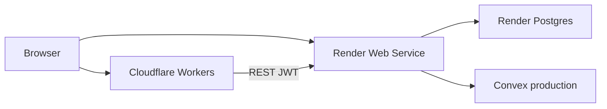

# PunPost Deployment

Frontend on **Cloudflare Workers** (OpenNext). Backend on **Render** (Django + Postgres). Data primary store: **Convex**.



## Prerequisites

- Cloudflare account + Wrangler login (`npx wrangler login`)
- Render account (Blueprint from `render.yaml` or dashboard)
- Convex account (`npx convex login`)
- Google / GitHub OAuth apps with production redirect URIs

## 1. Convex (production)

```bash
cd convex
npm install
npx convex deploy
```

Copy the production deployment URL into Render as `CONVEX_URL`.

Current production deployment from this repo:

- `https://outstanding-coyote-243.convex.cloud`

If your Django client uses a deploy key, set `CONVEX_DEPLOY_KEY` too.

## 2. Backend (Render)

Repo root contains [`render.yaml`](../render.yaml):

| Resource | Name | Notes |
|----------|------|--------|
| Web service | `punpost-api` | `rootDir: backend`, gunicorn, free plan |
| Postgres | `punpost-db` | free (30-day) or upgrade |

### Deploy

1. Push this repo to GitHub.
2. Render Dashboard → **New** → **Blueprint** → select the repo.
3. Fill `sync: false` env vars (see table below).
4. After first deploy, set `BACKEND_URL` to `https://<service>.onrender.com`.

Or with the Render CLI (once authenticated):

```bash
# https://render.com/docs/cli
render blueprints launch
```

### Build / start (already in Blueprint)

- Build: `./build.sh` → install, `collectstatic`, `migrate`
- Start: `gunicorn config.wsgi:application --bind 0.0.0.0:$PORT`

### Backend environment

| Variable | Required | Example |
|----------|----------|---------|
| `SECRET_KEY` | yes | generated by Render |
| `DEBUG` | yes | `False` |
| `DATABASE_URL` | yes | from Render Postgres |
| `ALLOWED_HOSTS` | yes | `.onrender.com` |
| `BACKEND_URL` | yes | `https://punpost-api.onrender.com` |
| `FRONTEND_URL` | yes | `https://punpost.<subdomain>.workers.dev` |
| `CONVEX_URL` | yes | Convex prod URL |
| `CONVEX_DEPLOY_KEY` | if used | Convex deploy key |
| `GOOGLE_CLIENT_ID` / `GOOGLE_CLIENT_SECRET` | for Google OAuth | from Google Cloud |
| `GITHUB_CLIENT_ID` / `GITHUB_CLIENT_SECRET` | for GitHub OAuth | from GitHub |
| `REDIS_URL` | no | omit → locmem + DB sessions |
| `SECURE_SSL_REDIRECT` | no | `True` (default when `DEBUG=False`) |

Health check: `GET /api/health/`

## 3. Frontend (Cloudflare Workers)

```bash
cd frontend
npm install
```

Set build-time public env (`.env.production` or Cloudflare dashboard vars):

```bash
NEXT_PUBLIC_API_URL=https://punpost-api.onrender.com/api
NEXT_PUBLIC_BACKEND_URL=https://punpost-api.onrender.com
```

Deploy:

```bash
npx wrangler login   # once
npm run deploy       # opennextjs-cloudflare build && deploy
```

Config files: `wrangler.jsonc`, `open-next.config.ts`, `next.config.ts`.

## 4. OAuth redirect URIs

In Google Cloud Console and GitHub OAuth App settings, add **exact** callbacks:

```
https://<BACKEND_HOST>/accounts/google/login/callback/
https://<BACKEND_HOST>/accounts/github/login/callback/
```

Keep local URIs for development if needed (`http://127.0.0.1:8000/...`).

## 5. Smoke test

1. `curl https://<BACKEND_HOST>/api/health/` → `status: ok`
2. Open frontend Workers URL → landing loads
3. Register / login with email
4. Google or GitHub OAuth → lands on `/dashboard` with JWT
5. Create + publish a post

## Local vs production

| Concern | Local | Production |
|---------|-------|------------|
| Django DB | SQLite | `DATABASE_URL` (Postgres) |
| Redis | optional | optional |
| Frontend API | `localhost:8000` | Render HTTPS |
| OAuth host | `127.0.0.1` ≠ `localhost` | must match `BACKEND_URL` |
