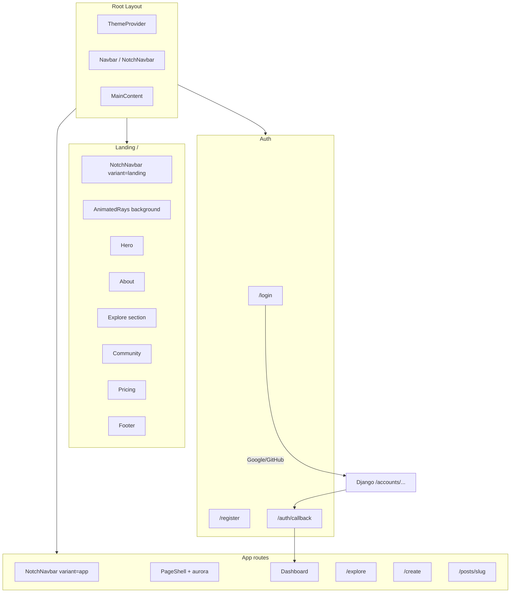
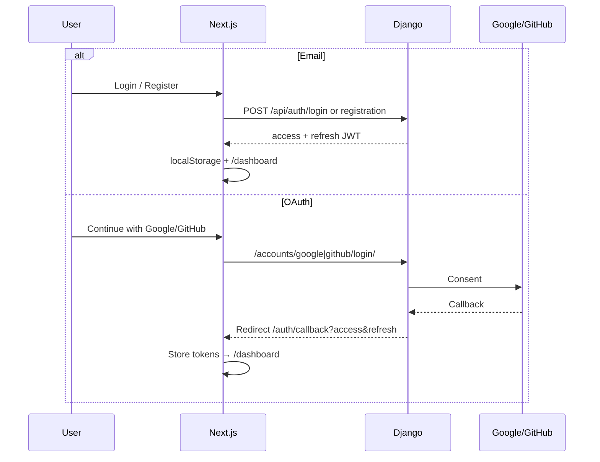

# PunPost Frontend

Documentation for the Next.js frontend: experimental landing page, auth/OAuth UX, app pages, and shared UI.

## Stack

| Piece | Choice |
|-------|--------|
| Framework | Next.js 16 (App Router) + React 19 |
| Language | TypeScript |
| Styling | Tailwind CSS 3 |
| Motion | Framer Motion |
| Icons | Lucide React |
| Auth client | JWT in `localStorage` + Bearer header |
| Themes | `next-themes` (class-based light/dark) |

## Quick Start

```bash
cd frontend
npm install
cp .env.local.example .env.local   # if present; otherwise create .env.local
npm run dev
```

Open [http://localhost:3000](http://localhost:3000).

### Environment

| Variable | Purpose | Example |
|----------|---------|---------|
| `NEXT_PUBLIC_API_URL` | Django API base (includes `/api`) | `http://localhost:8000/api` |
| `NEXT_PUBLIC_BACKEND_URL` | Django origin for OAuth redirects | `http://127.0.0.1:8000` |

`BACKEND_URL` on Django must match the OAuth callback host (`localhost` vs `127.0.0.1` are different to Google/GitHub).

---

## Architecture



---

## Routes

| Route | Nav variant | Description |
|-------|-------------|-------------|
| `/` | Landing (in-page) | Experimental marketing landing |
| `/login` | Landing links | Email + Google/GitHub |
| `/register` | Landing links | Email signup + OAuth |
| `/auth/callback` | Landing links | Stores JWT from OAuth, redirects to dashboard |
| `/dashboard` | App | User home after login |
| `/explore` | App | Editorial post feed |
| `/create` | App | Draft / publish form |
| `/posts/[slug]` | App | Post detail + comments |

### Navbar behavior

- **Landing** (`/`, `/login`, `/register`): Home · About · Explore · Community · Pricing.
- **App** (`/dashboard`, `/explore`, `/create`, `/posts/*`): Explore · Write · Dashboard only.
- **Logged in**: Log in / Sign up hidden; **Logout** only (plus theme toggle).
- **Logged out**: Log in + Sign up.

---

## Major Frontend Changes (this iteration)

### 1. Experimental landing page

Replaced the old shader + GlassDock homepage with an editorial composition:

- Full-page **AnimatedRays** aurora background
- **ImageTrail** cursor effect in the hero (disabled on touch / reduced motion)
- **NotchNavbar** floating notch architecture
- Sections: Hero → About → Explore rows → Community → Pricing → Footer
- Typography-first layout; subtle `border-foreground/5`; Framer Motion reveals

Key files:

```text
src/app/page.tsx
src/components/landing/*
src/components/ui/animated-rays.tsx
src/components/ui/image-trail.tsx
src/components/notch-navbar.tsx
```

### 2. Unified app chrome

- Shared **PageShell** (aurora + max-width content) on Explore, Create, Login, Register, Dashboard, Post detail
- Subpages use NotchNavbar instead of GlassDock
- Design tokens: `--background`, `--foreground`, `--stripe-color`, light/dark via `next-themes`

### 3. Auth & OAuth UX

- Email login/register call `/api/auth/login/` and `/api/auth/registration/`
- OAuth: browser redirect to Django allauth → `/api/auth/oauth/complete/` → `/auth/callback?access=&refresh=` → `/dashboard`
- JWT refresh interceptor in `src/lib/api.ts`
- Social buttons shared via `src/components/social-auth-buttons.tsx`

### 4. Dashboard

- Profile summary, Write / Explore / Logout actions, recent posts
- Post-login destination for email and OAuth

### 5. Create / publish

- Draft and published statuses via `POST /api/posts/`
- Clearer client errors (HTML Django debug pages sanitized in UI)

---

## Component Map

```text
src/
├── app/
│   ├── layout.tsx              # ThemeProvider, Navbar, MainContent
│   ├── page.tsx                # Landing composition
│   ├── globals.css             # Tokens, aurora, reduced-motion
│   ├── login/page.tsx
│   ├── register/page.tsx
│   ├── auth/callback/page.tsx
│   ├── dashboard/page.tsx
│   ├── explore/page.tsx
│   ├── create/page.tsx
│   └── posts/[slug]/page.tsx
├── components/
│   ├── Navbar.tsx              # Chooses landing vs app nav by path
│   ├── MainContent.tsx         # Top padding except on home
│   ├── notch-navbar.tsx
│   ├── page-shell.tsx
│   ├── theme-provider.tsx
│   ├── theme-toggle.tsx
│   ├── social-auth-buttons.tsx
│   ├── landing/
│   │   ├── Hero.tsx
│   │   ├── About.tsx
│   │   ├── Explore.tsx
│   │   ├── Community.tsx
│   │   ├── Pricing.tsx
│   │   ├── Footer.tsx
│   │   ├── PunPostLogo.tsx
│   │   ├── SectionLabel.tsx
│   │   ├── content.ts
│   │   └── motion.ts
│   └── ui/
│       ├── animated-rays.tsx
│       ├── image-trail.tsx
│       └── glass-dock.tsx      # Legacy; unused on main flows
└── lib/
    ├── api.ts                  # Axios + JWT + startOAuth()
    ├── auth.ts                 # Token helpers
    └── utils.ts                # cn()
```

---

## Auth Flow (Frontend)



---

## Design Language

- **Surfaces**: near-black / off-white via CSS variables; aurora for accent color
- **Borders**: `border-foreground/5` or `/10`
- **Type**: Geist (display) + Inter (body)
- **Motion**: opacity + translateY + light blur; respects `prefers-reduced-motion`
- **CTAs**: foreground/background pills (not purple SaaS chrome)
- **Lists**: editorial rows with arrow hover (Explore), not card grids

---

## Scripts

| Command | Description |
|---------|-------------|
| `npm run dev` | Dev server (Turbopack) |
| `npm run build` | Production build |
| `npm run start` | Serve production build |
| `npm run lint` | ESLint |

---

## Related Docs

- [Root README](../README.md) — project overview
- [Architecture](architecture.md) — full system design
- [Technical Reference](technical.md) — API and auth backend details
- [Educational Guide](educational.md) — learning notes

---

## Known Non-App Noise

Browser extensions (e.g. Grammarly) may inject attributes on `<body>` and trigger React hydration warnings. The root layout uses `suppressHydrationWarning` on `<html>` and `<body>` for this. Ignore Grammarly/`Iterable` console messages when debugging app issues.
